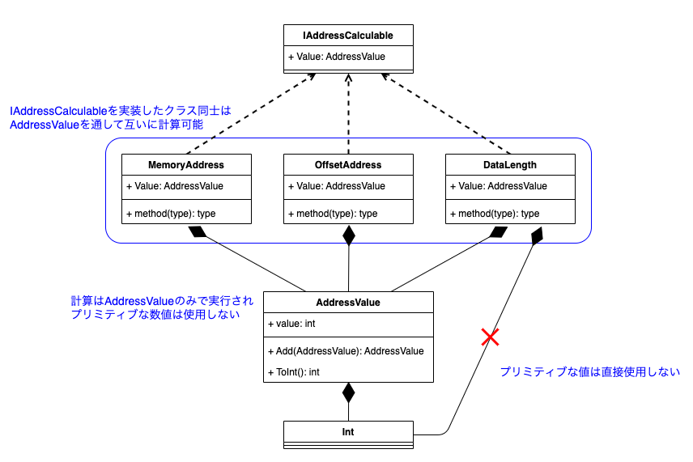
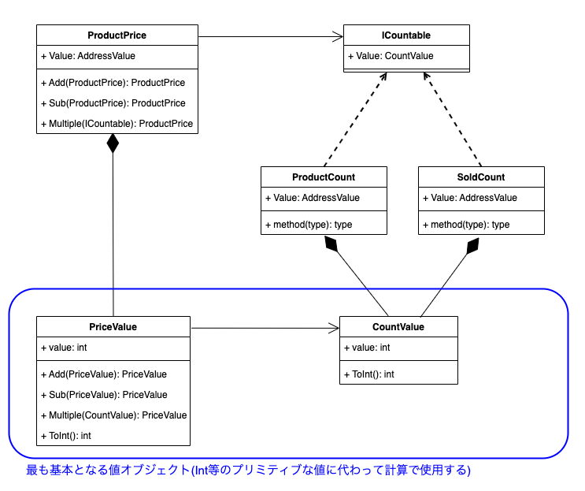

# 設計勉強会資料(2024/3/13)

## 概要説明

異なるクラスオブジェクト同士の計算を行う必要があるクラスの設計を考える。
ただし、なるべくプリミティブな型は使用しないで行たい。
つまり、以下のようなコードにはしたくない。

```csharp
sealed public class MemoryAddress
{
	private readonly int _value
	public MemoryAddress(int value)
	{
		Value = value;
	}

	// プリミティブな値を使用して計算しないで済むようにしたい。
	public MemoryAddress Increment(OffsetValue offset) =>
		new MemoryAddress(_value + offset.Value); //<= この計算がプリミティブで実行される
}

sealed public class OffsetAddress
{
	public readonly int Value {get;}
	public OffsetAddress(int value)
	{
		Value = value;
	}
}

var address = new MemoryAddress(1);
var offset = new OffsetAddress(2);
var calcutedAddress = address.Increment(offset.Value)
```

なぜこのように書きたくないかは、プリミティブな値で計算するには、
各クラスでプリミティブな型のプロパティ( 上記の場合はValue )を公開する必要があるためである。
プリミティブな型のプロパティを公開すると、
値をどこでも使用できるようになるためロジックが散らばる可能性がある。

```csharp
var offset = new OffsetAddress(3);
var age = new Age(10); // <= int型のpublicなValueプロパティを持つ。

// 計算に意味はないが、このように全く関係のない概念同士の計算が可能になり、
// 意図しない場所で、意図しない使われ方をされる可能性がある。
var result = offset.Value + age.Value;
```

## 対応案

プリミティブな値を使用したくないため、プリミティブに代わるValueObjectを用意する。


## 設計例

"メモリアドレス"、"メモリオフセット"、"メモリ内のデータ長"の３つのオブジェクトを考える。
これらは全てメモリのアドレスの計算を行うのに必要なため、
共通する概念(intとかfloatの代わりに)AddressValueという新しい値を用意する。
今後アドレスの計算にはAddressValueという値を使用する。



また、AddressValueをもつクラス同士が制限なく計算可能とするのではなく、
あるグループに所属するクラス同士で計算可能としたい。
そこで、IAddressCalculableインターフェースを用意して、
それを実装するクラス同士で算術可能なグループを作成する。

## 設計例(追加)

商品の価格を計算するために使用するクラス。
プリミティブ値に代わって、
価格の計算用クラス(PriceValue)と個数算出用クラス(CountValue)を作成して使用している。

